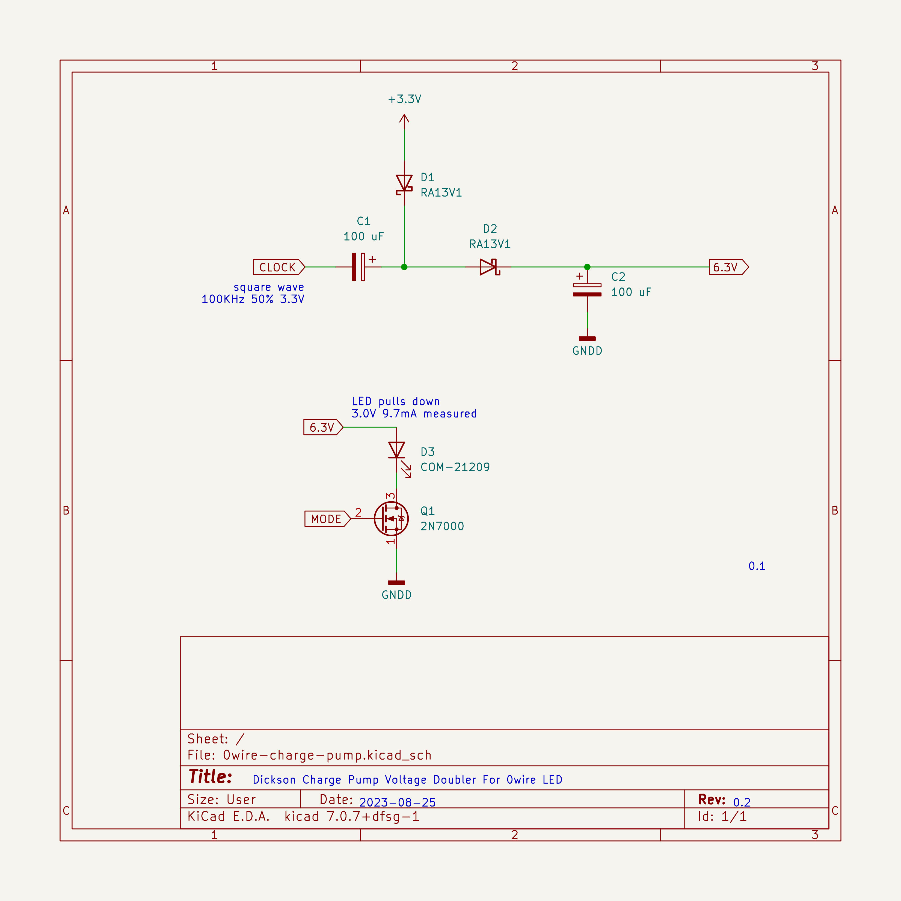

# mb2-0wire: "0Wire" RGB LED controller for MicroBit v2.
Bart Massey 2023

This crate demos control of a "0Wire" RGB LED controller for
the MicroBit v2.

This version features a partially soft voltage doubler
circuit. A 100KHz square wave is output on P16 of the MB2
edge connector. This output is used to drive a [Dickson
charge pump](https://en.wikipedia.org/wiki/Voltage_doubler#Dickson_charge_pump)
to provide a voltage around 6.5V open, adequate to fully
drive the green and blue LEDs in the 0-wire. In (white)
operation the LED draws about 9mA of current, pulling the
doubler output down to about 3V.

An NMOS switch will be used to provide the 0-wire signal for
the LED, as the LED supply cannot be toggled quickly enough
by manipulating the PWM due to capacitor discharge times.

# License

This work is licensed under the "MIT License". Please see the file
`LICENSE.txt` in this distribution for license terms.
